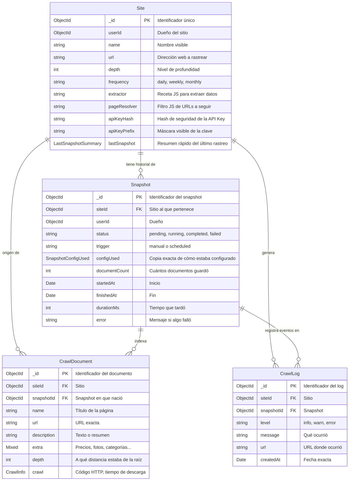
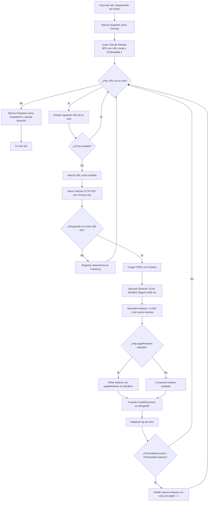

# Search Service - Guía Integral y Arquitectura del Backend (Para Principiantes y Desarrolladores)

Bienvenido a la documentación oficial de **Search Service**. Esta guía está escrita de forma didáctica para que cualquier persona —incluso si está dando sus primeros pasos en backend, Node.js o bases de datos— pueda comprender **al 100%** cómo funciona este sistema, por qué se diseñó de esta manera y cómo cada pieza encaja en el engranaje general.

---

## 1. ¿Qué es Search Service y qué problema resuelve?

Imagina que tienes una tienda online, un portal de noticias o un blog y quieres ofrecer a tus visitantes un buscador rápido, inteligente y personalizado. Normalmente, construir un motor de búsqueda requiere programar un "robot" que visite tus páginas, lea los textos, guarde la información organizada y luego permita buscar en ella.

**Search Service hace exactamente eso:**

1. Un usuario entra al panel y registra su sitio web (por ejemplo, `https://mitienda.com`).
2. El usuario define una pequeña "receta" en JavaScript que le dice al robot: *"Del título de la página toma esto, del precio toma aquello y del texto toma esto otro"*.
3. El backend envía a un **robot explorador (Crawler)** a visitar las páginas una por una.
4. El robot guarda todos los documentos encontrados organizados en una "fotografía en el tiempo" (**Snapshot**).
5. Tu sitio web puede consumir una **API Pública** mediante una clave secreta (`API Key`) para buscar en vivo sobre esa información.

---

## 2. ¿Cómo funciona el Backend en su totalidad?

Para entender el backend completo, imagina un restaurante de alta cocina:

```txt
[ Cliente / Usuario ]
        │ (1. Petición HTTP)
        ▼
┌────────────────────────────────────────────────────────┐
│                   SERVIDOR WEB (NestJS)                │
│                                                        │
│  [ Controller ]  ──>  El "Mesero" que recibe tu pedido │
│         │                                              │
│         ▼                                              │
│  [ Service ]     ──>  El "Cocinero" (Lógica de negocio)│
└────────────────────────────────────────────────────────┘
        │                        │
        │ (2. Guarda datos)      │ (3. Pone tarea pesada)
        ▼                        ▼
┌──────────────┐         ┌───────────────────────────────┐
│ BASE DE DATOS│         │ COLA DE TAREAS (Redis/BullMQ) │
│   MongoDB    │         │  El "Buzón de pedidos del     │
│ (Almacén)    │         │   robot rastreador"           │
└──────────────┘         └───────────────────────────────┘
                                         │
                                         │ (4. Despacha trabajo)
                                         ▼
                         ┌───────────────────────────────┐
                         │   ROBOT WORKER (Crawler)      │
                         │   Visita la web, usa Cheerio, │
                         │   extrae contenido y guarda   │
                         └───────────────────────────────┘
```

### ¿Por qué separamos el Servidor Web del Robot Worker?

Si el servidor web tuviera que visitar 50 páginas de internet antes de responderte, tu navegador se quedaría "cargando" durante minutos.

Por eso se utiliza una **arquitectura asíncrona dirigida por eventos**:

1. Cuando pides crear o rastrear un sitio, el servidor web guarda la orden en milisegundos, te responde inmediatamente *"¡Orden recibida!"* y coloca una ficha de trabajo en una cola de espera en memoria llamada **Redis** (usando la librería **BullMQ**).
2. En segundo plano, un **Worker (el Crawler)** toma esa ficha de trabajo y se pone a rastrear las páginas sin congelar ni ralentizar al resto de los usuarios.

---

## 3. Las 4 Entidades Principales y su Rol en el Negocio

En MongoDB guardamos la información en 4 "colecciones" (tablas). Cada una cumple un papel indispensable:



### 1. `Site` (El Sitio Web / El Contrato)

* **¿Qué representa?:** La configuración madre del sitio que quieres rastrear.
* **Rol en el negocio:**
  * Define la URL raíz (ejemplo: `https://ejemplo.com`).
  * Define la **profundidad (`depth`)**: ¿El robot solo mira la página principal (`depth: 1`) o también entra a los enlaces que encuentre (`depth: 2`, `3`...)?
  * Define las **funciones JavaScript del usuario** (`extractor` y `pageResolver`).
  * **Seguridad (`apiKeyHash` y `apiKeyPrefix`):** Cada sitio tiene su propia llave criptográfica (`sk_live_...`). No guardamos la clave en texto plano: guardamos su huella digital (hash SHA-256). Así, si alguien pirateara la base de datos, nunca podría ver las contraseñas reales.
  * **Eficiencia (`lastSnapshot` embebido):** Guarda un resumen directo del último estado del robot. Cuando abres la pantalla "Mis Sitios", la aplicación no tiene que buscar en miles de historiales; lee este campito en 1 milisegundo.

### 2. `Snapshot` (La Fotografía en el Tiempo)

* **¿Qué representa?:** Cada viaje de exploración que hace el robot. Si rastreas tu sitio hoy y dentro de una semana, tendrás **dos Snapshots diferentes**.
* **Rol en el negocio:**
  * **Inmutabilidad y Auditoría:** Guarda una copia exacta de la configuración que se usó en ese momento (`configUsed`). Si el día de mañana cambias tu extractor, los snapshots pasados no se alteran ni se rompen.
  * **Métricas:** Registra cuántos documentos se encontraron, cuántos milisegundos demoró y si terminó con éxito (`completed`) o con error (`failed`).
  * **Regla de Oro (Un solo snapshot activo):** ¿Qué pasaría si dos personas hacen clic en "Rastrear ahora" al mismo tiempo para el mismo sitio? Habría dos robots compitiendo y gastando recursos. Para impedirlo, creamos un **índice único parcial en MongoDB**: la base de datos rechaza físicamente cualquier intento de iniciar un snapshot si ya existe uno en estado `pending` o `running` para ese sitio.

### 3. `CrawlDocument` (El Contenido Extraído / Los Resultados)

* **¿Qué representa?:** Cada página individual que el robot leyó con éxito.
* **Rol en el negocio:**
  * Contiene el título (`name`), la dirección web (`url`) y el texto (`description`).
  * **Flexibilidad total (`extra`):** Gracias a que usamos MongoDB, un sitio de noticias puede extraer `{ autor, fecha, seccion }` mientras que una farmacia puede extraer `{ precio, stock, laboratorio }`. Ambos se guardan en el mismo modelo sin alterar tablas ni migraciones.
  * Es la materia prima donde el buscador de los usuarios buscará palabras clave en vivo.

### 4. `CrawlLog` (La Bitácora del Robot)

* **¿Qué representa?:** El diario de viaje del robot.
* **Rol en el negocio:**
  * Registra cada paso: *"Visité <https://ejemplo.com/contacto> (200 OK)"*, *"Error 404 en <https://ejemplo.com/privado>"*, o *"Error de sintaxis en el extractor del usuario"*.
  * Si un snapshot falla o extrae menos cosas de las esperadas, el usuario o el equipo técnico puede mirar los logs para saber exactamente en qué enlace y en qué segundo se originó el problema.

---

## 4. ¿Cómo se realiza el Crawling Job? (Paso a Paso)

El archivo [`src/crawler/crawler.processor.ts`](file:///c:/Users/sebas/code/search-service/backend/src/crawler/crawler.processor.ts) es el cerebro del robot. Así funciona su algoritmo paso a paso:



### Detalle de cada paso del Crawler

1. **Recepción del trabajo:**
   Redis le entrega al Worker un paquete con `{ siteId, snapshotId, userId }`.
2. **Cambio de estado a "En marcha":**
   El snapshot se marca como `running` y se registra la fecha y hora de inicio (`startedAt`).
3. **El Algoritmo de Exploración (BFS - Breadth-First Search):**
   El robot usa una lista de espera (cola FIFO). Comienza en la página principal (`depth: 1`). Si la profundidad máxima es `2`, visitará primero todas las páginas enlazadas desde la principal antes de profundizar más.
4. **Descarga Web Resiliente:**
   Hace una petición `fetch` con un `User-Agent` descriptivo y un límite de espera (`Timeout`) de 10 segundos para no quedar colgado si un servidor externo no responde.
5. **Lectura con Cheerio:**
   Cheerio convierte el texto HTML en una estructura similar a jQuery. Permite hacer cosas como `$('h1').text()` o `$('meta[name="description"]').attr('content')`.
6. **El Aislamiento Seguro (`node:vm` Sandbox):**
   > [!IMPORTANT]
   > ¿Qué pasa si un usuario escribe un extractor que intenta borrar archivos del servidor o contiene un bucle infinito `while(true)`?
   >
   > Para evitar desastres, el código del usuario se ejecuta en una "caja de arena" (**Sandbox**) usando el módulo nativo de Node.js `node:vm`. Dentro de esa caja no existe `process`, no existe acceso al disco duro (`fs`) ni a librerías externas. Además, tiene un límite estricto de **2 segundos**: si tarda más, se corta forzosamente.
7. **Descubrimiento y filtrado de Enlaces:**
   El robot busca todas las etiquetas `<a href="...">`. Resuelve URLs relativas (por ejemplo, `/productos` se transforma en `https://ejemplo.com/productos`), descarta anclas `#` y se asegura de **permanecer dentro del mismo dominio** (no saldrá a rastrear Twitter, Facebook ni sitios externos).
8. **Almacenamiento y Cierre:**
   Guarda el documento en la colección `documents`, actualiza el conteo de documentos y, al terminar la cola, calcula el tiempo total en milisegundos (`durationMs`) y marca el Snapshot y el Sitio como `completed`.

---

## 5. DTOs y Validación Automática

Todos los datos que entran a los controladores se validan con **`nestjs-zod`**:

* Si envías un número en vez de una URL, la aplicación no se rompe: responde inmediatamente con un error claro `400 Bad Request` indicando qué campo falló.
* Todos los DTOs están auto-documentados en **Swagger**: puedes entrar a `http://localhost:3000/api` y ver la documentación interactiva con ejemplos listos para probar.

---

## 6. Resumen de Flujo de Datos

```txt
[Usuario] ──(Crea sitio)──> [SiteController] ──> [SiteService]
                                                     │
                                                     ├──> Guarda Site en MongoDB
                                                     ├──> Crea Snapshot (pending)
                                                     └──> Encola trabajo en Redis (BullMQ)
                                                                 │
                                                                 ▼
                                                        [CrawlerProcessor]
                                                                 │
                                                     (Rastrea web con Cheerio)
                                                                 │
                                                     ┌───────────┴───────────┐
                                                     ▼                       ▼
                                             [CrawlDocuments]           [CrawlLogs]
                                            (Páginas guardadas)      (Bitácora de eventos)
```
